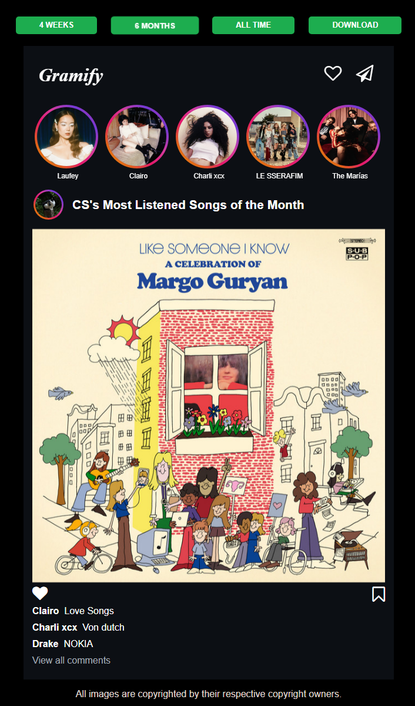

# 🎵 Gramify - Your Spotify Stats in Instagram Style

<div align="center">

[](https://www.python.org/)
[](https://flask.palletsprojects.com/)
[](https://developer.spotify.com/documentation/web-api/)
[](LICENSE)


*Transform your Spotify listening history into beautiful Instagram-style posters!* ✨

[Features](#features) • [Setup](#setup) • [Usage](#usage) • [Contributing](#contributing) • [License](#license)

</div>

## ✨ Features

🎨 **Instagram-Style Display**
- View your Spotify stats in a familiar Instagram post layout
- Beautiful, modern UI design inspired by social media
🖼️ **Save & Share**
- Download your stats across multiple time ranges as beautiful images

⏰ **Multiple Time Ranges**
- Last 4 weeks
- Last 6 months
- All time

<p align="center">
  

</p>


🎵 **Rich Music Information**
- Top 5 most listened artists
- Top 3 favorite songs
- Interactive links to Spotify

🔒 **Secure & Private**
- Spotify OAuth authentication
- No permanent data storage
- Session-based cookies

📱 **Responsive Design**
- Works seamlessly on desktop and mobile
- Optimized for various screen sizes

## 🚀 Technical Stack

<div align="center">


</div>

## 🛠️ Setup

### Prerequisites
- Python 3.6 or higher
- Active Spotify account (Free or Premium)
- Spotify Developer account

### Installation Steps

1️⃣ **Clone the repository**
```bash
git clone https://github.com/yourusername/gramify.git
cd gramify
```

2️⃣ **Install dependencies**
```bash
pip install -r requirements.txt
```

3️⃣ **Configure Spotify API**
- Visit [Spotify Developer Dashboard](https://developer.spotify.com/dashboard)
- Create a new application
- Set redirect URI: `http://localhost:5000/redirectPage`
- Note your Client ID and Secret

4️⃣ **Set up credentials**
Create `credentials.py` in the root directory:
```python
COOKIE_KEY = 'your_cookie_key'  # Any random string
CLIENT_ID = 'your_client_id'    # From Spotify
CLIENT_SECRET = 'your_client_secret'  # From Spotify
```

5️⃣ **Launch the app**
```bash
python app.py
```

6️⃣ **Access the website**
- Open your browser
- Visit `http://localhost:5000`

## 📱 Usage

1. Click the "Log into Spotify" button
2. Authorize access to your Spotify data
3. View your personalized Instagram-style poster
4. Switch time ranges with the buttons at the top
5. Click any artist or song to open in Spotify


## 🙏 Acknowledgments

- 📸 Inspired by Instagram's beautiful UI design
- 🎵 Powered by Spotify Web API
- 📚 Built with Spotipy library

---
